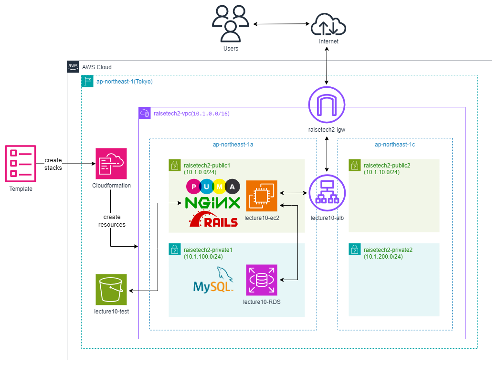

# Railsアプリケーションで使用する環境をCloudformationを用いて自動構築
<br>

## 目次<!-- omit in toc -->
- [概要](#概要)
- [動作環境](#動作環境)
- [使用リソースの詳細](#使用リソースの詳細)
- [インフラ構成図](#インフラ構成図)
- [学習記録](#学習記録)
<br>

## 概要
- CRUD 処理が出来る簡単な[Railsアプリケーション](https://github.com/yuta-ushijima/raisetech-live8-sample-app)を稼働できるインフラストラクチャを構成しました。
- Railsアプリケーションが動作するためのインフラリソース（VPC、EC2、RDSなど）は、AWS CloudFormationを使用して、自動で構築しました。詳細は[lecture10.md](./lecture10.md)を参照ください。
- Railsアプリケーションの動作環境（Ruby、Nginx、Puma、MySQLなど）は手動で設定しました。詳細は[lecture05.md](./lecture05.md)を参照ください。
- 動作環境の自動構築に関しては第12回、13回の講義で学習予定です。
<br>

## 動作環境
#### ruby
```bash
3.2.3
```

#### Bundler
```bash
2.3.14
```

#### Rails
```bash
7.1.3.2
```

#### Node
```bash
v17.9.1
```

#### yarn
```bash
1.22.19
```
<br>

## 使用リソースの詳細
#### EC2
- 学習コストを抑えるため1台構成です。
- インスタンスタイプも同様に学習コストを抑えるため、t2.microを使用しています。
- Amazon Linux 2のAMIを使用しています。

#### RDS
- こちらも学習コストを抑えるため、シングルAZ構成です。
- 外部からの不正アクセスを防ぐため、セキュリティグループでEC2からのアクセスのみ許可しています。

#### ALB
- EC2の前に設置し、受信したHTTP/HTTPSトラフィックをEC2へルーティングさせるようにしています。
- アプリケーションの拡張性と可用性を考慮し、ALBを選択しました。

#### S3
- データの可用性と耐久性を確保するため、アプリケーションの画像保存先として使用しました。
- S3のアクセス制御を適切に設定し、EC2インスタンスからのみアクセスを許可するIAMロールを作成しました。
<br>

## インフラ構成図

<br>

## 学習記録
現時点で完了している項目とこれからの学習予定についてまとめました。
|講座|概要|課題|課題ファイル|
|----|----|----|----|
|第1回|・AWS、クラウド技術について <br> ・インフラエンジニアとは|・AWSアカウントを作成 <br> ・IAMの推奨設定(MFA,Billing,AdministratorAccess) <br> ・AmazonLinux2で作成したCloud9でHelloWorldを出力(Ruby)|Discord上で提出|
|第2回|・バージョン管理システムについて <br> ・Gitの基本理解 <br> ・GitHub TIPS（Issue、Pull Request） <br> ・MarkDown記法|・GitHubアカウントを作成 <br> ・Cloud9のGit設定変更 <br> ・講座の感想をMarkdownで書き、GitHubでプルリクエストを発行|[leacture02.md](./lecture02.md)|
|第3回|・Webアプリケーションとは <br> ・システム開発の流れ <br> ・アプリケーションサーバについて|・Cloud9でサンプルアプリケーション(Rails)のデプロイ <br> ・APサーバー、DBサーバーについて調べる(サーバーの名前、バージョン)|[leacture03.md](./lecture03.md)|
|第4回|・手動で環境構築（VPC、EC2、RDS）|・AWS上に新しくVPCを作成し、EC2とRDSを構築 <br> ・EC2からRDSへ接続 <br> ※ここから先はVSCodeを使用|[leacture04.md](./lecture04.md)|
|第5回|・手動で環境構築（サンプルアプリケーション、ELB、S3）|・EC2上に第3回課題のサンプルアプリケーションをデプロイ <br> ・組み込みサーバー(puma)だけでデプロイ <br> ・動作したらサーバーアプリケーションを分けてデプロイ(Web:Puma,App:Nginx) <br> ・ELB(ALB)の追加 <br> ・S3の追加 <br> ・構成図の作成|[leacture05.md](./lecture05.md)|
|第6回|・システムの安定稼働 <br> ・AWSでの証跡、ロギング、監視、通知、コスト管理|・CloudTrailで最後にAWSを利用した日の証跡を見る <br> ・CloudWatchアラームでALBのアラームを設定して、SNSを使用しメール通知する <br> ・AWS利用料の見積作成(AWS Pricing Calculator) <br> ・現状のEC2利用料を確認|[leacture06.md](./lecture06.md)|
|第7回|・システムにおけるセキュリティの基礎 <br> ・AWS でのセキュリティ対策|・第5回で作成した環境は、どのような攻撃に対して「脆弱」か、また、どのような対策が取れそうかを考えてまとめる|[leacture07.md](./lecture07.md)|
|第8回|・第5回課題のライブコーディング(1)|-|-|
|第9回|・第5回課題のライブコーディング(2)|-|-|
|第10回|・インフラの自動化について <br> ・自動で環境構築（CloudFormation）|・CloudFormationを利用して、これまでに作成した環境をコード化する|[leacture10.md](./lecture10.md) <br> [CF-lecture10](./CF-lecture10) |
|第11回|・インフラのコード化を支援するツール <br> ・インフラのテストとは||ここから先は学習中|
|第12回|・Terraform、DevOps、CI/CD ツールとは|||
|第13回|・構成管理(プロビジョニング)ツールとは <br> ・Ansible、OpsWorks、CircleCIとの併用|||
|第14回|・第13回課題のライブコーディング(1)|||
|第15回|・第13回課題のライブコーディング(2)|||
|第16回|・現場へ出ていくにあたって必要な技術と知識 <br> ・現場での立ち振る舞い|||