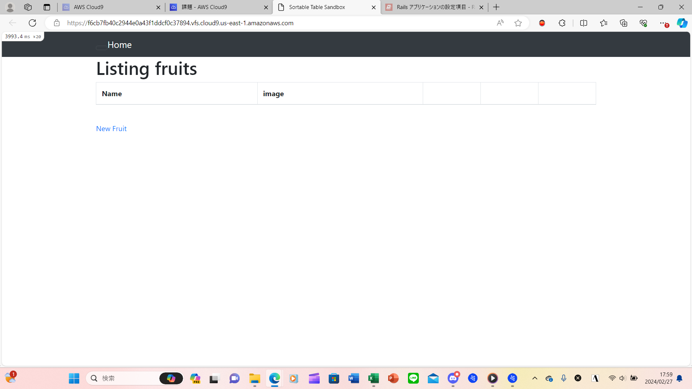

# 第3回課題
## 感想
- APサーバ：Ruby 3.1.2
- DBサーバ：MySQL 8.0.36
- Railsの構成管理ツール：Bundler
- エビデンス画像

- なんとかサンプルアプリを起動することができ、ほっとしました。しかし、それぞれがどういった役割のものなのかまではよく分かっていないので、一つずつ調べて理解していきたい。だが、文字だけでは分からないと思うので、これ以降の課題だけでなく、他のことにも実際に手を動かしながら挑戦して、体験的に理解していきたい。