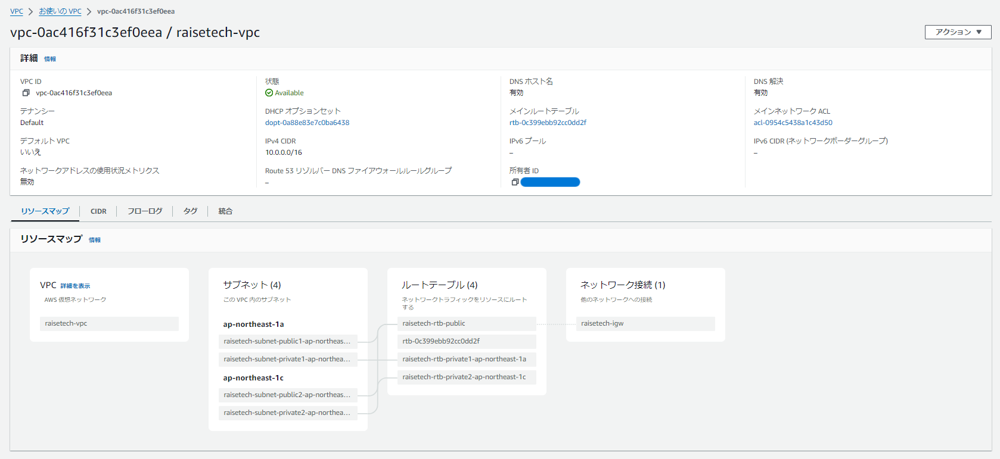
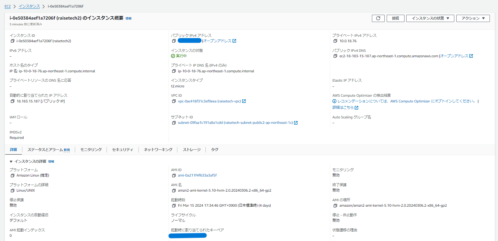
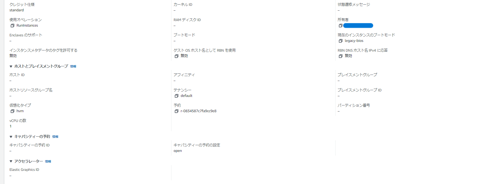
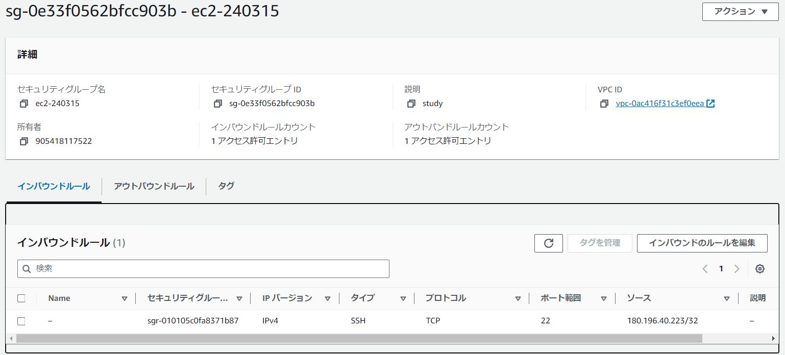
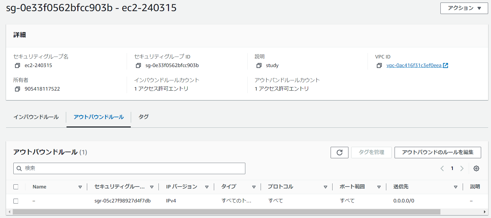
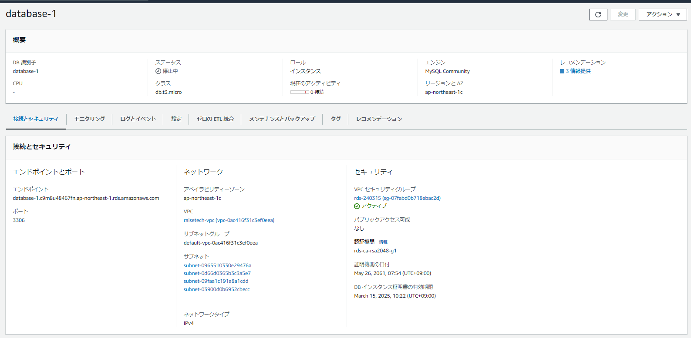
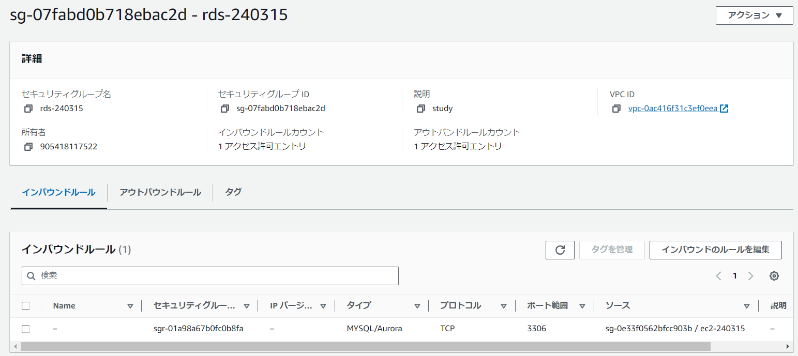
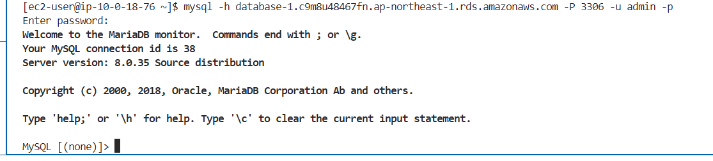

# 第4回課題
## エビデンス
- VPC

- EC2

- EC2　セキュリティグループ

- RDS

- RDS　セキュリティグループ

- EC2からRDSへ接続

### 感想
cloud9では上手くいかなかったので、第5回課題以降からでも使えるようにするために、VSコードを使用することにした。なぜ、cloud9では上手くいかなかったのかは検証する必要があるため、いつかは理解しようと思う。そして、ここから急に、より専門的になった気がした。それに伴い、学習時間も増え、1つの課題に時間がかかるようになった。心が折れそうになったが、食らいついていきたい、、！！！！！