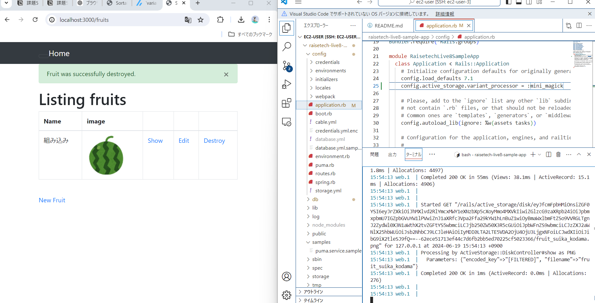
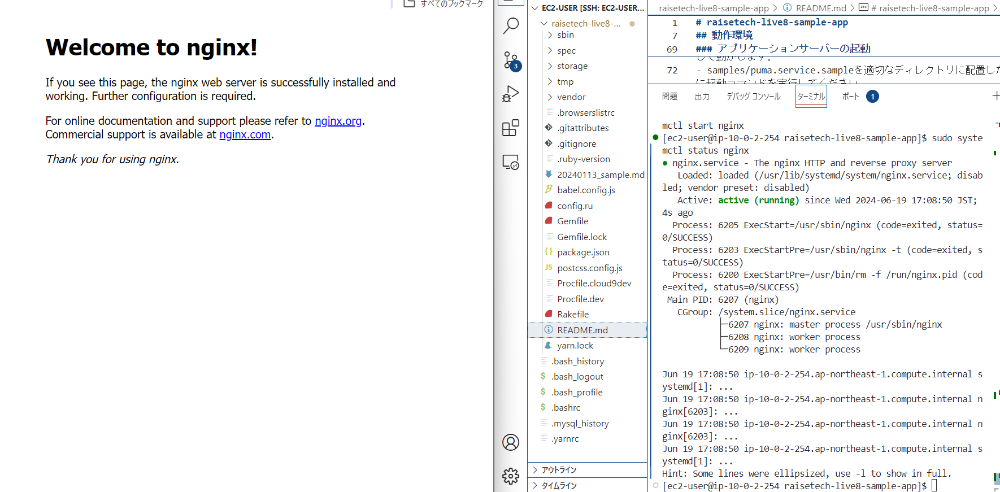
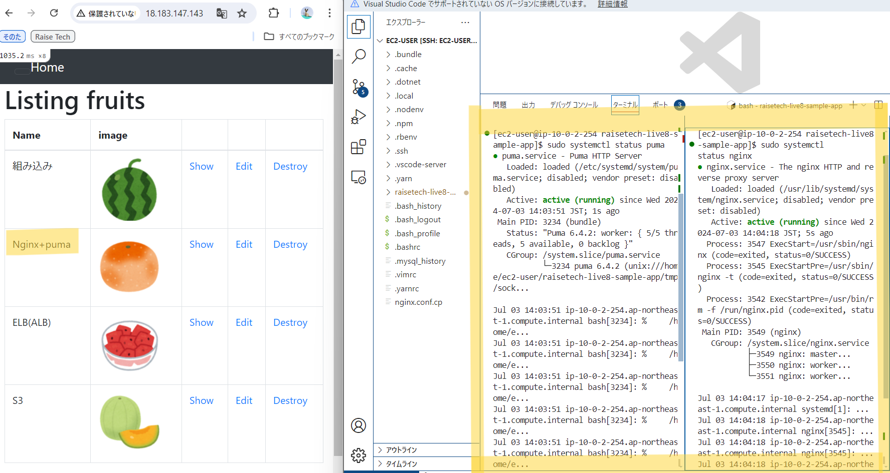
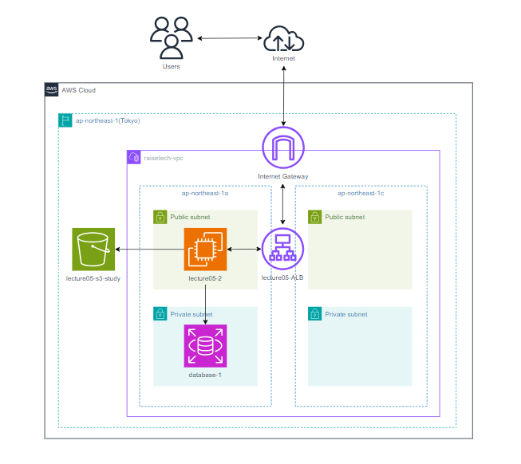

# 第5回課題<!-- omit in toc -->

## 目次<!-- omit in toc -->
- [組み込みサーバー(puma)のみで起動確認](#組み込みサーバーpumaのみで起動確認)
- [UNIXsocketに変更しcurlを使って起動確認](#unixsocketに変更しcurlを使って起動確認)
- [Nginxの単体起動確認](#nginxの単体起動確認)
- [UNIXsocketを用いてのpumaとnginxの接続確認](#unixsocketを用いてのpumaとnginxの接続確認)
- [ALBを追加して起動確認](#albを追加して起動確認)
- [railsアプリの画像の保存先をS3に変更](#railsアプリの画像の保存先をs3に変更)
- [AWS構成図](#aws構成図)
- [感想](#感想)

## 組み込みサーバー(puma)のみで起動確認
ここまでの手順は[こちら](lecture05/1-pumaのみ.md)に記載しております。
- 組み込みサーバーのみで起動確認

## UNIXsocketに変更しcurlを使って起動確認
ここまでの手順は[こちら](lecture05/2-UNIXsocket.md)に記載しております。
- UNIXsocketのみでpuma起動
.png)
- curlで確認
.png)

## Nginxの単体起動確認
ここまでの手順は[こちら](lecture05/3-Nginx単体.md)に記載しております。
- nginxのサーバーの起動確認とブラウザ確認

## UNIXsocketを用いてのpumaとnginxの接続確認
ここまでの手順は[こちら](lecture05/4-pumaとnginx.md)に記載しております。
- UNIXsocketを用いてのpumaとnginxの接続確認

## ALBを追加して起動確認
ここまでの手順は[こちら](lecture05/5-ALB.md)に記載しております。
- ALB作成
.png)
- ヘルスチェック
.png)
- DNSで起動確認
.png)

## railsアプリの画像の保存先をS3に変更
ここまでの手順は[こちら](lecture05/6-画像の保存先をS3に変更.md)に記載しております。
- S3バケット作成
.png)
- IAMロール作成
.png)
- ポリシー作成
.png)
- EC2にIAMロールを付与
.png)
- 起動確認
.png)
- railsアプリの画像保存先をS3に変更
.png)
- 保存された画像
.png)
.png)
.png)
## AWS構成図
- 今回の構成

## 感想
- 提出までにものすごい時間をかけてしまった。何度も何度も嫌になったが、なんとかやりきった。遅れてしまった分をなるべく取り戻したい！！
- CSSの反映、railsアプリ7以上のときの画像表示の仕方、親ディレクトリに適切な権限がないと、その中の子ディレクトリやファイルにアクセスすることができないことについては一生忘れない。