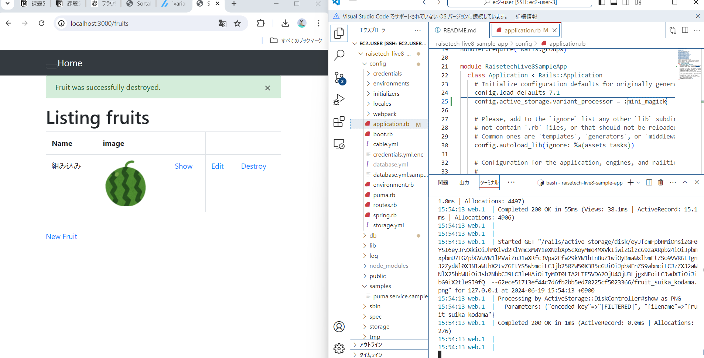

# 1.組み込みサーバー(puma)のみで起動確認まで

### ①ターミナル上で確認するログの時間を見やすくするために、EC2上の時間を日本時間に変更
- タイムゾーンをJSTに設定
```sh
sudo ln -sf /usr/share/zoneinfo/Asia/Tokyo /etc/localtime
```
- タイムゾーンがJSTに変更されたか確認
```sh
date
```
- タイムゾーンを恒久的に設定するため、/etc/sysconfig/clock の設定を変更
```sh
sudo vi /etc/sysconfig/clock
```
**【変更部分】**
- UTC → Asia/Tokyo
```sh
ZONE="Asia/Tokyo"
UTC= true
```
<br>

### ②全てのインストール済みパッケージを最新の状態に更新
```sh
sudo yum update
```
<br>

### ③gitを使えるようにする
```sh
sudo yum install git
git --version
```
<br>

### ④サンプルアプリをクローン
```sh
git clone https://github.com/yuta-ushijima/raisetech-live8-sample-app.git
```
<br>

### ⑤Railsアプリケーションの構築に必要なライブラリや依存パッケージをインストール
```sh
sudo yum  -y install git make gcc-c++ patch libyaml-devel libffi-devel libicu-devel zlib-devel readline-devel libxml2-devel libxslt-devel ImageMagick ImageMagick-devel openssl-devel libcurl libcurl-devel curl wget
```
<br>

### ⑥rbenvのインストール
- rbenv のソースコードをGitHub からローカルの ~/.rbenv ディレクトリにクローン
```sh
git clone https://github.com/sstephenson/rbenv.git ~/.rbenv
```
- rbenv コマンドをどこからでも実行できるようにするために、システムの PATH 環境変数に rbenv のインストールパスを追加
```sh
echo 'export PATH="$HOME/.rbenv/bin:$PATH"' >> ~/.bash_profile
```
- シェル起動時に rbenv の必要な初期化処理を自動で実行し、任意のディレクトリから rbenv を利用可能にする
```sh
echo 'eval "$(rbenv init -)"' >> ~/.bash_profile
```
- .bash_profile に設定した内容をすぐに反映させる
```sh
source .bash_profile
```
<br>

### ⑦ruby-build のインストール
```sh
git clone https://github.com/sstephenson/ruby-build.git ~/.rbenv/plugins/ruby-build
```
<br>

### ⑧ruby をバージョン指定してインストールし、確認
```sh
rbenv install 3.2.3
rbenv global 3.2.3
rbenv rehash
ruby -v
```
<br>

### ⑨bundlerをバージョンを指定してインストールし、確認

※`bundler -v`を行うと、`Bundler version 2.4.19`と表示されることがあるが、サンプルアプリのディレクトリにいくと、Bundler のバージョンが Gemfile.lock に基づいて自動的に設定されるため、`Bundler version 2.3.14`と表示される。
```sh
gem install bundler -v 2.3.14
gem list bundler
```
<br>

### ⑩railsをバージョン指定してインストールし、確認
```sh
gem install rails -v 7.1.3.2
rails -v
```
<br>

### ⑪nvmインストール
- 指定されたURLからデータを取得し、スクリプトをそのままbashに渡して実行
```sh
curl -o- https://raw.githubusercontent.com/nvm-sh/nvm/最新バージョン/install.sh | bash
```
- nvmのインストール先ディレクトリを環境変数`NVM_DIR`に設定し、この設定を`~/.bashrc`ファイルに追加
```sh
echo 'export NVM_DIR="$HOME/.nvm"' >> ~/.bashrc
```
- nvmを使えるようにする
```sh
echo '[ -s "$NVM_DIR/nvm.sh" ] && \. "$NVM_DIR/nvm.sh"' >> ~/.bashrc
```
<br>

### ⑫node-buildのインストール
```sh
git clone https://github.com/nodenv/node-build.git ~/.nodenv/plugins/node-build
```
<br>

### ⑬node をバージョン指定してインストールし、確認
```sh
nvm install v17.9.1
node -v
```
<br>

### ⑭yarn をバージョン指定してインストールし、確認
```sh
npm install -g yarn@1.22.19
yarn -v
```
<br>

### ⑮MariaDBのアンインストール
```sh
yum list installed | grep mariadb
sudo yum remove mariadb* 
```
<br>

### ⑮MySQLのインストール
- MySQLのリポジトリをyumに追加
```sh
# sudo yum localinstall -y <コピーしたリンク>
sudo yum localinstall -y https://dev.mysql.com/get/mysql84-community-release-el7-1.noarch.rpm
```
- MySQLサーバーをインストール
```sh
sudo yum install -y mysql-community-server
```
- MySQLの開発用ライブラリをインストール
```sh
sudo yum install -y mysql-community-devel
```
- インストールされたMySQL関連のパッケージを確認
```sh
yum list installed | grep mysql
# このように出力されていれば完了
mysql-community-client.x86_64         8.4.3-1.el7                    @mysql-8.4-lts-community
mysql-community-client-plugins.x86_64 8.4.3-1.el7                    @mysql-8.4-lts-community
mysql-community-common.x86_64         8.4.3-1.el7                    @mysql-8.4-lts-community
mysql-community-devel.x86_64          8.4.3-1.el7                    @mysql-8.4-lts-community
mysql-community-icu-data-files.x86_64 8.4.3-1.el7                    @mysql-8.4-lts-community
mysql-community-libs.x86_64           8.4.3-1.el7                    @mysql-8.4-lts-community
mysql-community-server.x86_64         8.4.3-1.el7                    @mysql-8.4-lts-community
mysql84-community-release.noarch      el7-1                          installed
```
- MySQLサーバーの起動と状態確認
```sh
sudo systemctl start mysqld
sudo systemctl status mysqld
```
<br>

### ⑯MySQLのログイン確認
<br>

**ローカル接続（EC2上）**
- 初期パスワード確認
```sh
sudo cat /var/log/mysqld.log | grep "temporary password" | awk '{print $13}'
```
- ログイン確認

※このコマンドを実行した後にパスワードを入力。**パスワードは入力しても、表示されない**ので注意。
```sh
mysql -u root -p
```
- ログインした状態で、パスワード変更
```sh
ALTER USER 'root'@'localhost' IDENTIFIED BY '設定するパスワード';
FLUSH PRIVILEGES;
```
- 変更したパスワードでログインできるか確認
```sh
mysql -u root -p
```
<br>

**EC2からRDS**
- ログイン確認

※ここでのパスワードはRDS作成時に設定した「マスターパスワード」
```sh
mysql -h データベースのエンドポイント　-P 3306 -u マスターユーザー名 -p
```
<br>

### ⑰database.ymlの書き換え
- database.yml.sampleをコピーし、database.ymlファイル作成
```sh
cp config/database.yml.sample config/database.yml
```
- database.ymlの接続先を編集
  - usernameをRDSマスターユーザー名に変更
  - パスワードをRDSのマスターパスワードに変更
  - `host: ”RDSのエンドポイント”`を追加
  - development と test の socket をコメントアウト

<br>

### ⑱EC2のセキュリティグループのインバウンドルールで、「ポート3000、作成したVPCのIPv4」を設定

<br>

### ⑲環境構築
```sh
bin/setup
```
<br>

### ⑳エラー 
```sh
Install missing gems with bundle install
```
不足しているGem（依存ライブラリ）をインストールするために `bundle install`を実行する
↓
- Gemfileに記載された依存関係のGemをインストール
```sh
bundle install
```
- 再度、環境構築
```sh
bin/setup
```
<br>

### ㉑組み込みサーバーの起動
```sh
bin/dev
```
<br>

### ㉒エラー
```sh
11:55:08 js.1   | /bin/sh: webpack: command not found
11:55:08 js.1   | error Command failed with exit code 127.
```
webpack コマンドが見つからない。
↓
- 依存関係をインストールし、確認
```sh
yarn install
yarn webpack --version
# 下記のように表示されれば完了
$ /home/ec2-user/raisetech-live8-sample-app/node_modules/.bin/webpack --version
webpack: 5.76.0
webpack-cli: 4.10.0
webpack-dev-server not installed
Done in 0.21s.
```
<br>

### ㉓`bin/dev`後、ブラウザのアドレスバーに`localhost:3000`を入力してアクセスし、起動確認できたが、画像が表示されない
↓
- 画像を表示させるため、 config/application.rb に`config.active_storage.variant_processor = :mini_magick`を追記  

※railsのversionが6から7以降にアップグレードした場合、デフォルトでvipsを使う設定になっているので、railsのバージョン7以降で imagemagick を使えるようにするには、`config.active_storage.variant_processor = :mini_magick`を追加する必要がある。

<br>

### ㉔再度、`bin/dev`→`localhost:3000`を行い、動作確認をする

