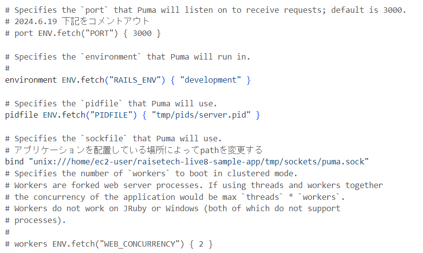

# 2.UNIXsocketに変更しcurlを使って起動確認

### ①UNIXsocketに変更
- puma.sockのパスを確認
```sh
cd raisetech-live8-sample-app/tmp/sockets
pwd
```
- config/puma.rbに記載されている`bind`と先ほどのパスが合っているかの確認
- `port ENV.fetch("PORT") { 3000 }`の先頭に「#」をつけてコメントアウト

※ポート3000をコメントアウトをしないと、UNIXsocketではなく、ポート3000での接続が優先されてしまう。

<br>

### ②puma.rb の設定を適用させるため、以下のコマンドを実行し、pumaがUNIXsocketでListen状態になっているか確認
```sh
bundle exec puma -C config/puma.rb
```
- 起動確認
.png)
<br>

### ③別ターミナルで以下のcurlコマンドを実行し、起動確認
```sh
# #curl --unix-socket <ソケットへのパス> http://localhost/
curl --unix-socket /home/ec2-user/raisetech-live8-sample-app/tmp/sockets/puma.sock http://localhost/
```
.png)