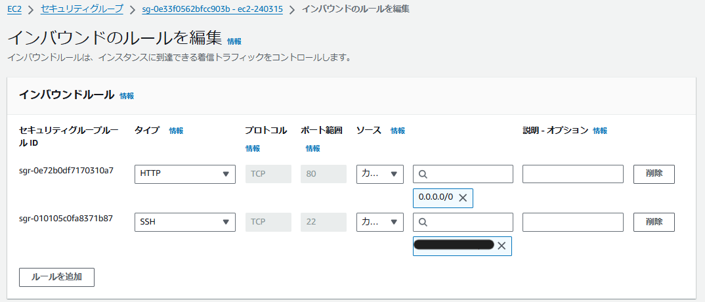

# 3.Nginxの単体起動確認

### ①Nginxをインストールするために使用する`amazon-linux-extras`がシステムに存在しているか確認
```sh
which amazon-linux-extras
```
<br>

### ②Amazon Linux Extrasで利用できるNginxのバージョンを確認
```sh
amazon-linux-extras list | grep nginx
```
<br>

### ③Nginxをインストール
```sh
sudo amazon-linux-extras install nginx1
```
<br>

### ④インストールされたNginxのバージョンを確認
```sh
nginx -v
```
<br>

### ⑤Nginxを起動し、状態を確認
```sh
sudo systemctl start nginx
sudo systemctl status nginx
```
<br>

### ⑥EC2のセキュリティグループのインバウンドルールで、ポート3000を削除し、「ポート80、0.0.0.0/0」を追加

<br>

### ⑦ブラウザのアドレスバーに`http://サーバーのパブリックIPアドレス`を入力して、起動しているか確認
