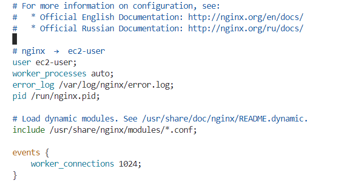
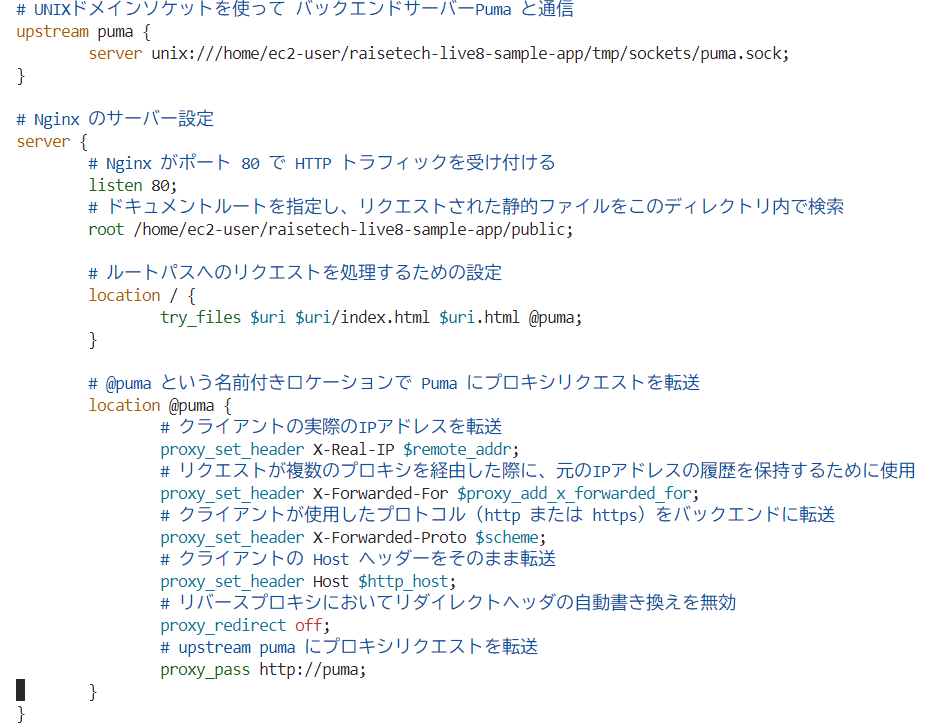

# 4.UNIXsocketを用いてのpumaとnginxの接続確認

### ①pumaをアプリケーションサーバーとして動かすために、systemdによってpumaを起動させる
- puma.service.sample から puma.service を適切なディレクトリにコピー
```sh
sudo cp /home/ec2-user/raisetech-live8-sample-app/samples/puma.service.sample /etc/systemd/system/puma.service
```
- `/etc/systemd/system`配下に追加した `puma.service` ファイルを認識させるために、新しい設定ファイルを反映
```sh
sudo systemctl daemon-reload
```
- 起動して状態確認
```sh
sudo systemctl start puma
sudo systemctl status puma
```
<br>

### ②nginx.confをバックアップ
```sh
sudo cp /etc/nginx/nginx.conf /etc/nginx/nginx.conf.cp
```
<br>

### ③nginx.confを編集
```sh
sudo vi /etc/nginx/nginx.conf
```
**【変更内容】**
- userを`ec2-user`に変更


<br>

### ④`/etc/nginx/conf.d`配下に`app.conf`を作成し、アプリケーションのNginx設定を記述

※conf.dにアプリ用のconfを作成すれば、nginx.confのuserなど、conf.dに書き込めないもの以外は書き換える必要がなくなる
- `app.conf`を作成し、アプリケーションのNginx設定を下の画像のように記述
```sh
sudo touch /etc/nginx/conf.d/app.conf
sudo vi /etc/nginx/conf.d/app.conf
```



- Nginx の設定ファイル全体をチェックして正しいかどうかを確認
```sh
sudo nginx -t
# 以下のように出力されていれば完了
nginx: the configuration file /etc/nginx/nginx.conf syntax is ok
nginx: configuration file /etc/nginx/nginx.conf test is successful
```

- 設定を反映させるため再起動
```sh
sudo systemctl restart nginx
```
<br>

### ⑤`http://サーバーのパブリックIPアドレス`で起動はしたが、CSSが反映されず、画像ありでのsaveも出来なくなったため、それぞれ対処
<br>

**CSSの反映**
- エラー（ブラウザのデベロッパーツールより）
```sh
GET http://IPアドレス/assets/application-fae796cccb5b5aaf5177cf1d6ca3509489d1f3bf2a19c4d23891f96164eb2624.css net::ERR_CONTENT_LENGTH_MISMATCH 200 (OK)
```
↓
- 静的アセットが適切に提供されず、ブラウザに読み込まれたCSSファイルが「ERR_CONTENT_LENGTH_MISMATCH」のエラーを引き起こしていたため、「アセットファイルの整合性が崩れている可能性があり、アセットの再生成を行えば解決するだろう」という仮説を立て、以下のコマンドを実行し再生成を行う
```sh
RAILS_ENV=development bundle exec rake assets:precompile
```
<br>

**画像ありでsave**
- エラー(nginx/error.logより)
 ```sh
[crit] 3536#3536: *36 open() "/var/lib/nginx/tmp/client_body/0000000002" failed (13: Permission denied)
```
↓
- ファイルにアクセスできないエラーが発生したため、以下のコマンドを実行して、nginx ディレクトリの所有者を ec2-user に変更

```sh
sudo ls -l /var/lib/ | grep nginx
# nginx.confでは、userを「ec2-user」に変更したが、nginxのディレクトリでは「root」になっていることが分かる
　drwxrwx--- 3 nginx   root      17 Jun 19 17:07 nginx

#「ec2-user」に変更し、nginxサーバーを再起動
sudo chown -R ec2-user /var/lib/nginx
sudo ls -l /var/lib/ | grep nginx
　drwxrwx--- 3 ec2-user root      17 Jun  1 17:08 nginx
# 設定を反映させるため再起動
sudo systemctl restart nginx
```
<br>

### ⑥再度、確認

