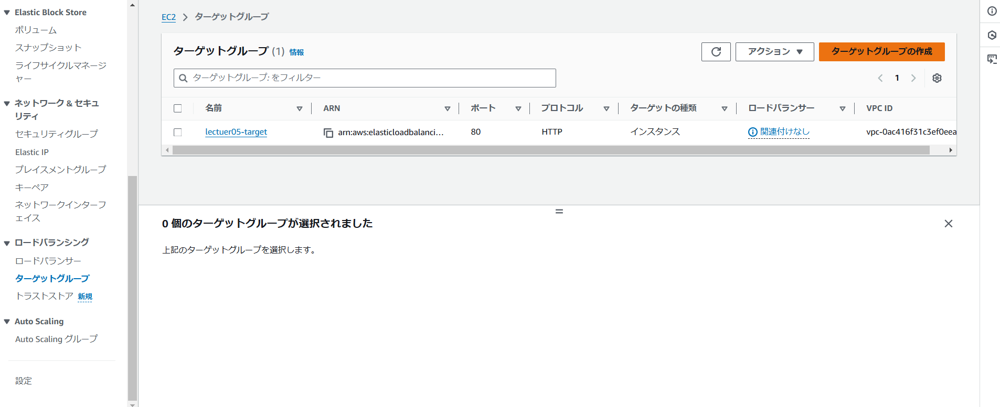

# 5.ALBを追加して起動確認

### ① targetグループ作成とヘルスチェック
<br>

**ターゲットグループ作成**
- EC2のサイドバーから「ターゲットグループ」をクリック
- 「ターゲットグループの作成」をクリック


- 「インスタンス」を選択


- 任意のターゲットグループ名を入力
- プロトコル：ポートは「HTTP 80」
- IPアドレスタイプは「IPv4」
- VPCは「使用しているEC2が含まれるVPC」を選択
- プロトコルバージョンは「HTTP1」
- 「次へ」をクリック


<br>

**ターゲットを登録**
- 「保留中として以下を含める」を選択し、「ターゲットグループの作成」をクリック


<br>

### ②ALB用にセキュリティグループ作成
- インバウンドは「ポート80を開放してソースを0.0.0.0/0」に、アウトバウンドは「すべてのポートを開放し送信先を0.0.0.0/0」に設定


<br>

### ③ ロードバランサーを作成し、ヘルスチェック
<br>

**ロードバランサーの作成**
- EC2のダッシュボードまたはサイドバーから「ロードバランサー」をクリック
- 「ロードバランサーの作成」をクリック
- 「Application Load Balancer」を選択


- 「任意のロードバランサー名」を入力
- スキームは「インターネット向け」
- ロードバランサーのIPアドレスタイプは「IPv4」


- VPCは「使用しているEC2が含まれているもの」を選択
- マッピングのサブネットは最低2つ選択する必要があるため、1つは「使用しているEC2が含まれるサブネット」、もう1つは「別のパブリックサブネット」を選択


- セキュリティグループは「先ほど作成したセキュリティグループ」を選択
- リスナーとルーティングは転送先に「先ほど作成したターゲットグループ」を選択


.png)
<br>

**ヘルスチェック**
- nginxサーバーを起動させておかないと「異常」となってしまうので、起動させておく

.png)
<br>

### ④ アドレスバーにロードバランサーのDNS名を入力して、接続確認するとエラー


↓
- development.rb に「config.hosts << "ALBのDNS名"」を追記し、再起動


```sh
sudo systemctl restart puma
```
<br>

### ⑤再度DNS名をブラウザのアドレスバーに貼り付けて接続確認

.png)
<br>

### ⑥セキュリティを高めるため、EC2のセキュリティグループのインバウンドで、ポート80のソースを「使用しているEC2を含むVPCのIPアドレス」に変更し、再度接続確認