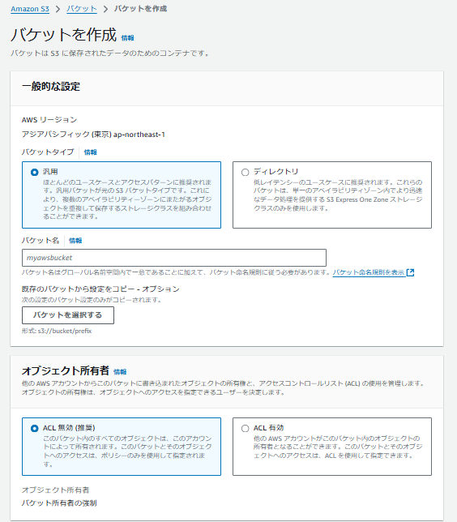

# 6.railsアプリの画像の保存先をS3に変更
### ①S3のバケット作成
- 「S3」と検索し、「S3」をクリック


- 「バケットの作成」をクリック
- リージョンが「東京」であることを確認
- バケットタイプは「汎用」を選択
- バケット名は**グローバル名前空間内で一意である**ことに注意して、バケット名を入力
- オブジェクト所有者は「ACL無効」を選択


- ブロックパブリックアクセス設定は「すべてをブロック」にする
- バージョニングは「無効」


- 暗号化タイプは「SSE-S3」、バケットキーは「有効」にして、「バケットを作成」をクリック


.png)
<br>

### ②IAMロールのポリシー作成
- 「IAM」と検索し、「IAM」をクリック
- ダッシュボードにある「IAMリソース」の「ポリシーの数字」をクリック。または、サイドバーから「ポリシー」を選択。


- 「ポリシーの作成」をクリック
- ポリシーエディタは「JSON」を選択し、画像のように記載したら「次へ」をクリック


- 「ポリシー名、説明」を入力し、許可されているサービスが「S3」であることを確認したら、「ポリシーの作成」をクリック
- 先ほど作成したポリシー名で検索して、ヒットすれば作成完了


.png)
<br>

### ③IAMロール作成
- 「IAM」と検索し、「IAM」をクリック
- ダッシュボードにある「IAMリソース」の「ロールの数字」をクリック。または、サイドバーから「ロール」を選択。
- 「ロールを作成」をクリック
- 信頼されたエンティティタイプは「AWSのサービス」を選択し、サービスまたはユースケースは「EC2」を選択し、その下のユースケースも「EC2」を選択。


- 許可ポリシーは先ほど作成したポリシーを選択


- 「ロール名、説明」を入力し、信頼されたエンティティに「EC2」、許可ポリシーに「作成したポリシー」があることを確認したら、「ロールを作成」をクリック
- 先ほど作成したロール名で検索して、ヒットすれば作成完了


.png)
<br>

### ④EC2にIAMロールの付与
- EC2インスタンス→使用するインスタンスを選択→アクション→セキュリティ→IAMロールを変更をクリック


- 「先ほど作成したIAMロール」を選択


- 「IAMロール」の部分に先ほど付与したロールが記載されているか確認

.png)
<br>

### ⑤development.rb内の`config.active_storage.service`を`local`から`amazon`に変更


<br>

### ⑥storage.ymlの`bucket`を`<%= ENV['AWS_S3_BUCKET_NAME'] %>`から`作成したバケット名`に変更


<br>

### ⑦上記の内容を反映させるため、下記のコマンドを実行
```sh
sudo systemctl restart puma
```
<br>

### ⑧DNS名で接続した後、サンプルアプリで画像を保存し、少し待ってからバケット内を確認すると、大・中・小の3種類の画像が保存されている
- 起動確認

.png)
<br>

- railsアプリの画像保存先をS3に変更

.png)
<br>

- 保存された画像

.png)
.png)
.png)