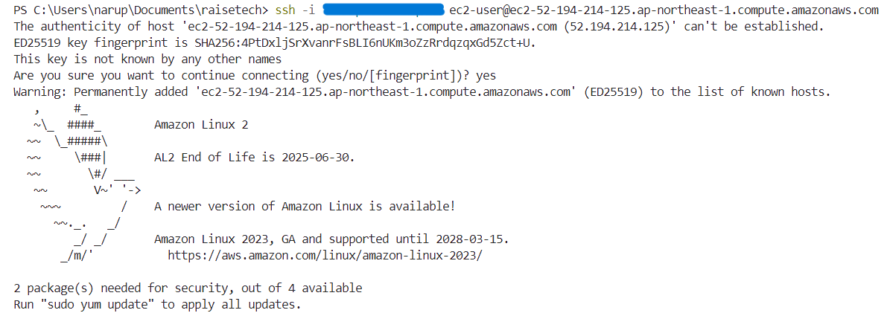

# 第10回課題
## 概要
1. 作成したテンプレートファイル
2. VPC
3. EC2
4. ALB
5. RDS
6. S3
7. 接続確認
8. 感想

### 1. 作成したテンプレートファイル
- [CF-VPC.yml](CF-lecture10/CF-VPC.yml)
- [CF-EC2.yml](CF-lecture10/CF-EC2.yml)
- [CF-ELB.yml](CF-lecture10/CF-ELB.yml)
- [CF-RDS.yml](CF-lecture10/CF-RDS.yml)
- [CF-S3.yml](CF-lecture10/CF-S3.yml)
  
### 2. VPC
- VPC  

  
### 3. EC2
- EC2  

.png)
- EC2 sg
.png)
  
### 4. ALB
- ALB  

- target group  

  
### 5. RDS
- RDS  

- RDS sg
.png)
  
### 6. S3
- S3  

  
### 7. 接続確認
- EC2  

- RDS  

  
### 8. 感想
- 記述しなくてもデフォルトで自分の思っている設定がされるものがあるので、そこは書かずになるべくすっきりとさせた。その際、少しだが公式ドキュメントになれることが出来たと思う。
- すべて書き終わって思ったのは、1つにまとめた方が書きやすいと思った。しかし、今回は初めてということもあり、まとめて書くとぐちゃぐちゃになりそうだと思ったので、サービスごとに分けてみた。開発の仕方によって、そのときの適切な方法が異なると思うので、どちらにもなれておきたい。