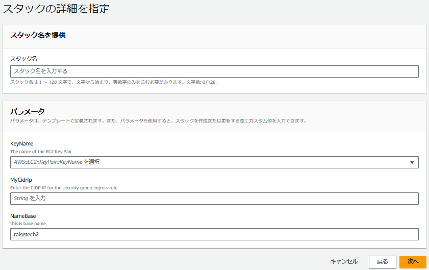
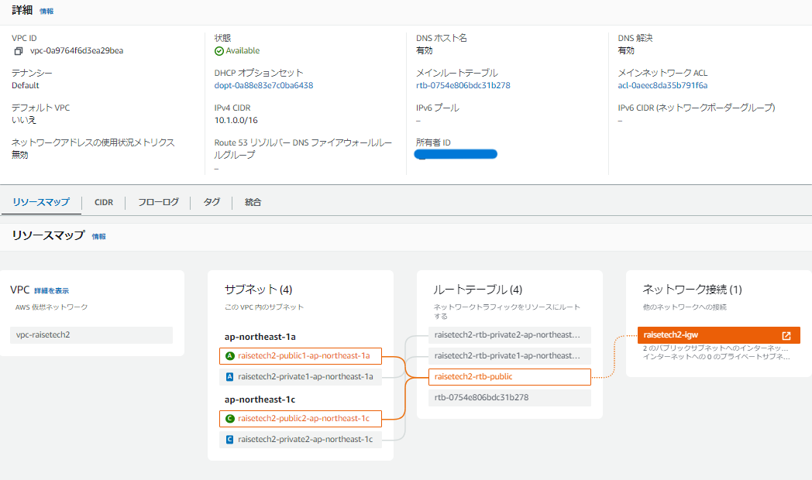
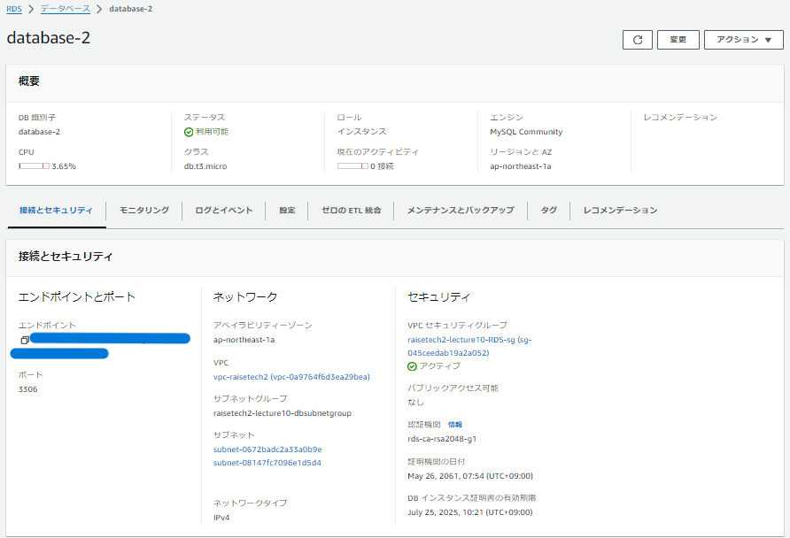
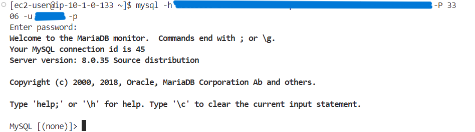

# 第10回課題
## 目次<!-- omit in toc -->
[1. 作成したテンプレートファイル](#1-作成したテンプレートファイル) [2. 作成手順](#2-作成手順) [3. VPC](#3-vpc) [4. EC2](#4-ec2) [5. ALB](#5-alb) [6. RDS](#6-rds) [7. S3](#7-s3) [8. 接続確認](#8-接続確認) [9. 感想](#9-感想)

### 1. 作成したテンプレートファイル
- [CF-VPC.yml](CF-lecture10/CF-VPC.yml)
- [CF-EC2.yml](CF-lecture10/CF-EC2.yml)
- [CF-ELB.yml](CF-lecture10/CF-ELB.yml)
- [CF-RDS.yml](CF-lecture10/CF-RDS.yml)
- [CF-S3.yml](CF-lecture10/CF-S3.yml)

**【内訳】**
|テンプレート|リソース内訳|
|:--|:--|
|CF-VPC.yml|・VPC ・PublicSubnet(a,c) ・PrivateSubnet(a,c) ・PublicRouteTable ・PrivateRouteTable(a,c) ・InternetGateway ・InternetGatewayAttachment ・PublicRoute ・PublicSubnet(a,c)RouteTableAssociation ・PrivateSubnet(a,c)RouteTableAssociation |
|CF-EC2.yml|・EC2SecurityGroup ・EC2 ・ InstanceProfile |
|CF-ELB.yml|・TargetGroup ・ALB ・ALBListener ・ALBSecurityGroup |
|CF-RDS.yml|・RDSSubnetGroup ・RDSInstance ・RDSSecurityGroup |
|CF-S3.yml|・S3Bucket |

 

### 2. 作成手順
- 「cloudformation」と検索し、「cloudformation」をクリック

- 「スタックの作成」または「スタックの作成→新しいリソースを使用」をクリック

- テンプレートの準備は「既存のテンプレートを選択」を選択
- テンプレートソースは「テンプレートファイルのアップロード」を選択し、作成したファイルをアップロードしたら、「次へ」をクリック

- 「スタック名」を入力
- 「パラメータ」をファイル内で設定した場合は、必要事項を設定し「次へ」をクリック

- 「任意のタグ」や「任意のアクセス許可」を設定

- プロビジョニング失敗時の動作は「すべてのスタックリソースをロールバックする」を選択
- ロールバック中に新しく作成されたリソースを削除するについては「削除ポリシーを使用する」を選択

- 「詳細オプション」は必要があれば設定する
- テンプレートファイルを用いてIAMリソースを作成する場合は、チェックボックスに「チェック」を入れ、「次へ」をクリック

- 最終確認をして、問題なければ「送信」をクリック
- 画像のような状態になれば、作成完了

 

### 3. VPC
- VPC  

  
 
### 4. EC2
- EC2  

.png)
- EC2 sg

.png)
 

### 5. ALB
- ALB  

- target group  

 

### 6. RDS
- RDS  

- RDS sg

.png)
 

### 7. S3
- S3  

 
  
### 8. 接続確認
- EC2  

- RDS  

 
  
### 9. 感想
- 記述しなくてもデフォルトで自分の思っている設定がされるものがあるので、そこは書かずになるべくすっきりとさせた。その際、少しだが公式ドキュメントになれることが出来たと思う。
- すべて書き終わって思ったのは、1つにまとめた方が書きやすいと思った。しかし、今回は初めてということもあり、まとめて書くとぐちゃぐちゃになりそうだと思ったので、サービスごとに分けてみた。開発の仕方によって、そのときの適切な方法が異なると思うので、どちらにもなれておきたい。